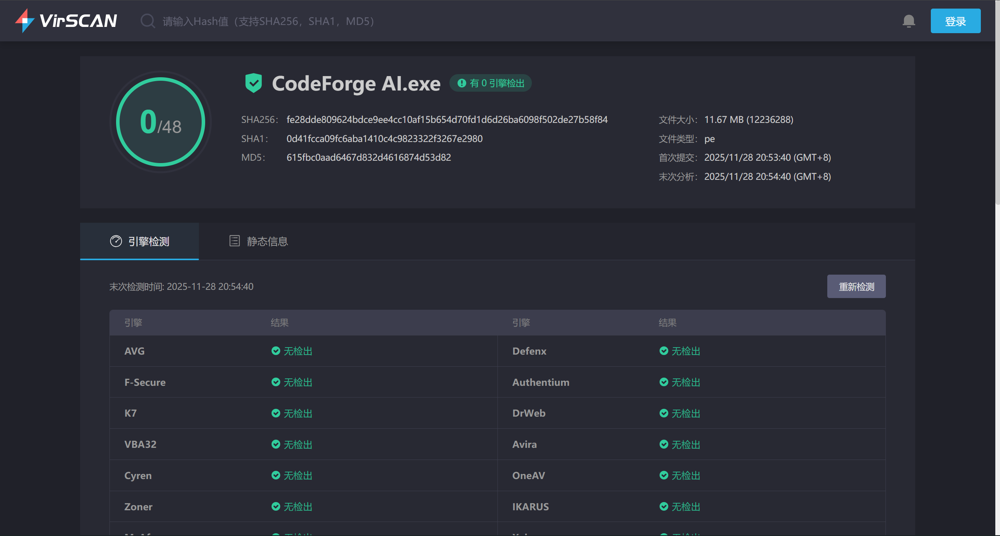
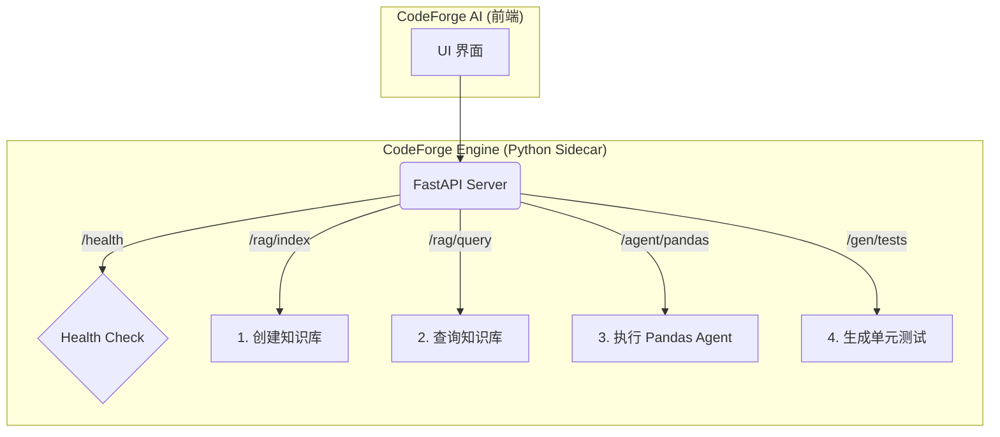

  <!-- Logo 图片：如果没有专用 Logo，可以使用 Banner 截图，宽度设为 auto -->
  

  <h1 align="center">CodeForge AI</h1>

  

    <strong>Forge your code with intelligence.</strong>
     
    专为开发者打造的 AI 辅助生产力终端：上下文组装 · 提示词管理 · 全局 AI 对话
  

  <!-- 动态徽章 (Shields.io) -->
  

    
    
    
    
    
  

 

**CodeForge AI** 是一款专为开发者打造的 AI 辅助生产力工具。它集成了代码上下文组装、提示词管理以及一个随时待命的全局 AI 终端，旨在无缝连接你的 IDE 与大语言模型（LLM）。

## 🛠️ 技术栈 (Tech Stack)

本项目采用现代化的**高性能桌面应用架构**构建，兼顾了极小的资源占用与流畅的用户体验，整体大小为12MB，运行内存占用约7MB：

*   **Core**: [Tauri](https://tauri.app/) (Rust + WebView) - 提供原生级的性能与超小的安装包体积。
*   **Frontend**: React 18 + TypeScript + Vite - 现代化的前端开发体验。
*   **State Management**: Zustand - 轻量且强大的状态管理。
*   **Styling**: Tailwind CSS + tailwindcss-animate - 快速构建美观的 UI。
*   **Icons**: Lucide React.

## 核心功能指南

### 1. Context Forge (上下文锻造)
**解决痛点：** 快速将项目文件打包成 LLM (ChatGPT/Claude/DeepSeek) 易读的格式。

*   **文件选择**：在左侧文件树中勾选你需要让 AI 理解的代码文件或文件夹。
*   **智能统计**：底部仪表盘会实时显示选中文件的总大小、**预估 Token 数量**以及语言分布。
*   **Token 优化**：
    *   开启 **"Remove Comments"** 开关，自动剥离代码注释，节省大量 Token。
    *   自动识别并过滤二进制文件（如图片、PDF）。
*   **一键输出（建议下载为txt）**：点击 **Copy**，软件会将项目结构树和文件内容生成为结构化的 XML 文本，直接粘贴给 AI 即可。

### 2. Spotlight (全局 AI 终端)
**快捷键：** `Alt + S` (Windows/Linux) 或 `Option + S` (macOS)

Spotlight 是一个始终置顶的悬浮窗，拥有两种模式，按 **`Tab`** 键切换：

#### 🔍 搜索模式 (Search Mode)
快速检索并使用你的指令库。
*   **搜索**：输入关键词查找本地或已下载的 Prompt/Command。
*   **预览**：右侧展示指令详情。
*   **复制**：按 `Enter` 直接将内容复制到剪贴板。如果是带变量的模板（如 `git commit -m "{{msg}}"`），会自动弹出输入框让你填充变量。

#### ✨ AI 对话模式 (AI Chat Mode)
无需切换浏览器，直接与 AI 对话。
*   **切换**：在搜索模式下按 `Tab` 键进入紫色界面的 AI 模式。
*   **对话**：输入问题并回车，体验流式打字机回复。支持 Markdown 渲染和代码高亮。
*   **思考过程**：支持 DeepSeek-R1 等推理模型，可折叠查看 AI 的 "Thinking Process"。
*   **清空上下文**：按 `Ctrl + K` (或 `Cmd + K`) 清空当前临时会话。
    *   *注意：Spotlight 主打“即用即走”，对话历史仅保存在内存中，重启软件后会自动清除。*

### 3. Prompt Verse (提示词库)
管理你的常用指令和 AI 提示词。

*   **创建与编辑**：支持创建自定义分组，编写包含变量（`{{variable}}`）的通用模板。
*   **官方商店**：在设置中进入 **Library**，下载离线的指令包（如 Linux 命令大全、编程辅助 Prompts）。
*   **遮蔽机制**：如果你收藏并修改了官方指令，本地修改将覆盖官方版本，互不冲突。

---

### 4.Patch Weaver (AI补全器)

正在加急开发中

## 配置指南 (Setup)

为了使用 Spotlight 的 AI 对话功能，你需要配置模型提供商：

1.  点击左侧侧边栏底部的 **设置 (Settings)** 图标。
2.  进入 **AI Configuration** 选项卡。
3.  填写 API 信息：
    *   **Provider**: 选择 `DeepSeek` / `OpenAI` / `Anthropic` (仅作图标区分)。
    *   **API Key**: 填入你的 API 密钥（数据仅存储在本地）。
    *   **Base URL**: (可选) 如果使用 **硅基流动 (SiliconFlow)** 或其他中转服务，请填写对应的 Base URL（例如 `https://api.siliconflow.cn`）。
    *   **Model ID**: 填入模型名称（例如 `deepseek-ai/DeepSeek-V3`）。

---

## 常用快捷键一览

| 快捷键 | 作用域 | 功能 |
| :--- | :--- | :--- |
| `Alt + S` | 全局 | 唤起/隐藏 Spotlight 搜索框 |
| `Tab` | Spotlight | 切换 **搜索模式** / **AI 模式** |
| `Enter` | Spotlight | (搜索模式) 复制指令 / (AI 模式) 发送消息 |
| `Ctrl + K` | Spotlight | (AI 模式) 清空当前对话历史 |
| `Esc` | 全局 | 关闭当前窗口或弹窗 |

---

## 下载与安装

请前往 [Releases](../../releases) 页面下载适合您操作系统的安装包，或者直接下载运行版本，无需安装点击即用（数据存储在`C:\Users\<name>\AppData\Local\com.codeforge.ai`内）：
*   **Windows**: `.msi` 或 `.exe`
---

## 关于报毒

启动应用时，你可能会看到 **“Windows 已保护你的电脑” (Microsoft Defender SmartScreen)** 的蓝色拦截窗口。

**这是正常现象**。因为 CodeForge AI 是一个由个人维护的开源项目，没有购买昂贵的微软数字签名证书 (EV Code Signing Certificate)，所以会被系统标记为“未知发布者”。

**如何运行：**
1. 在蓝色拦截窗口中，点击 **<u>更多信息 (More info)</u>**。
2. 点击下方出现的 **仍要运行 (Run anyway)** 按钮。

> 🔒 **安全承诺**：本项目完全开源，构建过程由 GitHub Actions 自动化完成，绝不包含任何恶意代码。如果您仍有顾虑，欢迎审查源码自行构建。

*CodeForge AI - Forge your code with intelligence.*

## 致谢与开源声明 (Credits)

特别感谢以下项目提供的数据支持与灵感：

*   **[tldr-pages](https://github.com/tldr-pages/tldr)**: 本项目的命令库数据（Command Packs）部分来源于此，感谢他们为繁杂的 man pages 提供了简洁实用的替代方案。
*   **[Awesome ChatGPT Prompts](https://github.com/f/awesome-chatgpt-prompts)**: 本项目的提示词库数据（Prompt Packs）部分来源于此。

---

*CodeForge AI - Forge your code with intelligence.*

---

### **第一部分：引擎的宏观愿景与设计原则**

**产品名称**：**CodeForge AI Engine** (一个由主程序按需下载和调用的 Python 后端服务)

**核心定位**：作为 CodeForge AI 的“重型计算大脑”，专门处理那些在前端（JavaScript）中难以实现或效率低下的 AI 任务。

**设计原则**:
1.  **无状态 API (Stateless API)**：引擎本身不保存长期会话。所有状态（如加载了哪个知识库）都由前端通过 `session_id` 来管理。这使得引擎可以轻松重启和扩展。
2.  **异步处理 (Asynchronous)**：所有耗时操作（如索引一个大型代码库）都必须是异步的，并提供状态查询接口，防止 UI 卡死。
3.  **安全第一 (Security First)**：任何涉及执行代码或访问本地文件的操作，都必须有明确的日志和（在必要时）前端的用户确认环节。
4.  **可扩展性 (Extensible)**：API 设计应易于未来增加新的 AI 功能（如图像分析、音频处理等）。

---

### **第二部分：核心功能模块规划 (LangChain 的用武之地)**

我们将引擎划分为三大核心能力模块，每个模块都对应一组强大的 LangChain 功能。

#### **模块一：📚 知识库问答 (Retrieval-Augmented Generation - RAG)**
这是 LangChain 最核心、最强大的功能。它能让 AI “学习”你的私有数据，并基于这些数据回答问题。

*   **功能 1.1: 项目代码库问答 (Project RAG)**
    *   **用户场景**: “我的项目中，`useAppStore` 这个函数具体是做什么的？它在哪里被调用了？”
    *   **LangChain 组件**:
        *   **加载器 (Loader)**: `DirectoryLoader` 配合 `TextLoader` 递归加载指定项目文件夹下的所有代码文件。
        *   **分割器 (Splitter)**: `RecursiveCharacterTextSplitter`，按代码的语法结构（函数、类）进行智能切块。
        *   **嵌入模型 (Embeddings)**: 使用 `HuggingFaceEmbeddings` 加载一个**本地运行的、免费的**嵌入模型（如 `bge-base-en-v1.5`），确保代码**永远不会离开用户电脑**。
        *   **向量数据库 (VectorStore)**: `FAISS` (内存) 或 `ChromaDB` (硬盘持久化)，用于存储代码块的向量表示，实现快速检索。
        *   **检索链 (Chain)**: `create_retrieval_chain`，将用户问题、检索到的代码片段和聊天历史组合起来，生成最终答案。

*   **功能 1.2: 技术文档问答 (PDF/Markdown RAG)**
    *   **用户场景**: “我刚下载了 `Tauri` 的官方 PDF 文档，帮我总结一下它的窗口管理 API 有哪些？”
    *   **LangChain 组件**:
        *   **加载器**: `PyPDFLoader` (PDF), `UnstructuredMarkdownLoader` (Markdown)。
        *   **其余部分**: 与 1.1 完全复用。

*   **功能 1.3: 网页内容问答 (Web RAG)**
    *   **用户场景**: “我正在看这篇关于 React Hooks 的教程（URL），请解释一下 `useEffect` 的依赖项数组是什么意思。”
    *   **LangChain 组件**:
        *   **加载器**: `WebBaseLoader`，输入一个 URL，自动抓取并解析网页正文。
        *   **其余部分**: 与 1.1 完全复用。

#### **模块二：🔬 代码与数据分析智能体 (Agents)**
让 AI 不仅能“看”，还能“动手”分析。

*   **功能 2.1: CSV/Excel 数据分析 (Pandas Agent)**
    *   **用户场景**: “我有一个 `sales.csv` 文件，帮我画一张图，显示每个月的销售额趋势。”
    *   **LangChain 组件**:
        *   `create_pandas_dataframe_agent`，这个 Agent 可以理解自然语言，并将其翻译成 Pandas Python 代码来操作数据。
    *   **🛡️ 安全机制**: Agent 生成的 Python 代码**必须**先发回前端，由用户确认后，引擎再执行。

#### **模块三：✨ 高级代码生成 (Advanced Code Generation)**
超越简单的模板填充，生成更复杂的代码。

*   **功能 3.1: 单元测试生成 (Test Generation)**
    *   **用户场景**: “这是我的 `utils.ts` 文件，请为 `calculateIdealTreeWidth` 这个函数编写单元测试。”
    *   **LangChain 组件**:
        *   使用 `PromptTemplate` 构建一个精巧的提示词，包含函数源码、上下文依赖和测试框架要求（如 Jest）。
        *   调用 `LLMChain` 生成测试代码。

---

### **第三部分：API 架构设计 (FastAPI)**

我们将使用 FastAPI 构建引擎的 HTTP 服务，监听本地端口（如 `127.0.0.1:8899`）。

#### **API 端点 (Endpoints) 规划**

1.  `GET /health`
    *   **用途**: 主程序用来检查引擎是否已成功启动。
    *   **返回**: `{"status": "ok"}`

2.  `POST /rag/index`
    *   **用途**: 索引一个数据源（文件夹、PDF、URL）并创建一个知识库会话。
    *   **请求体**: `{ "source_type": "directory" | "pdf" | "url", "path": "C:/path/to/project" }`
    *   **处理**:
        *   这是一个耗时操作。引擎会立即返回一个 `session_id`。
        *   引擎在后台开始加载、切分、嵌入、存入向量数据库。
    *   **返回**: `{"session_id": "uuid-1234", "status": "indexing"}`

3.  `POST /rag/query`
    *   **用途**: 对一个已创建的知识库会话进行提问。
    *   **请求体**: `{ "session_id": "uuid-1234", "query": "What is useAppStore?", "chat_history": [...] }`
    *   **处理**:
        *   根据 `session_id` 找到对应的 RAG 链。
        *   执行检索和问答。
    *   **返回**: `{"answer": "The useAppStore function is...", "sources": ["/path/to/file1.ts", "/path/to/file2.tsx"]}`

4.  `POST /agent/pandas`
    *   **用途**: 对 CSV/Excel 文件执行数据分析。
    *   **请求体**: `{ "file_path": "C:/data/sales.csv", "query": "Show me top 5 sales"}`
    *   **处理**:
        *   **第一步 (生成代码)**: LangChain Agent 生成 Pandas 代码。
        *   **返回**: `{"status": "confirmation_required", "code_to_run": "df.head(5).plot()"}`
        *   **第二步 (执行代码)**: 前端显示代码并让用户确认。用户点击“执行”后，前端再次请求此接口。
    *   **再次请求体**: `{ "file_path": "...", "query": "...", "confirmed_code": "df.head(5).plot()" }`
    *   **返回**: `{"result_type": "plot" | "text", "data": "image_path.png" | "text_result"}`

---

### **第四部分：分阶段开发路线图 (Roadmap)**

不要试图一次性完成所有功能。按下面的顺序，每一步都能交付一个可用的 MVP。

#### **阶段一：引擎的“心跳” (2-3 天)**
1.  **任务**: 搭建基础框架。
2.  **后端 (Python)**:
    *   创建 FastAPI 项目。
    *   实现 `/health` 接口。
3.  **打包**:
    *   编写 `PyInstaller` 的 build 脚本，能将 FastAPI 应用打包成单个 `.exe` 文件。
4.  **主程序 (Tauri)**:
    *   在设置中添加“AI 引擎”页面。
    *   实现下载、解压、保存增强包的逻辑。
    *   实现 `start_engine` Rust 命令，能够成功启动下载的 `.exe`。
    *   UI 能够调用 `/health` 接口并显示“引擎已连接”的状态。
5.  **目标**: 用户可以在设置里成功下载并启动引擎。

#### **阶段二：第一个杀手级功能 - 项目代码问答 (1-2 周)**
1.  **任务**: 实现 Project RAG。
2.  **后端 (Python)**:
    *   集成 `DirectoryLoader`, `RecursiveCharacterTextSplitter`, 本地嵌入模型和 `FAISS`。
    *   实现 `/rag/index` 和 `/rag/query` 接口。
    *   用一个简单的字典来管理 `session_id` 和 RAG 链实例。
3.  **主程序 (UI)**:
    *   创建一个新的主视图，名为 "AI Chat"。
    *   UI 上允许用户选择一个项目文件夹。
    *   选择后，调用 `/rag/index`，并显示“正在索引项目...”。
    *   索引完成后，提供一个聊天框，用户输入问题，调用 `/rag/query`，并将结果和来源文件展示出来。
5.  **目标**: 用户可以和自己的代码库进行对话。

#### **阶段三：扩展知识库能力 (1 周)**
1.  **任务**: 支持 PDF 和网页。
2.  **后端 (Python)**:
    *   在 `/rag/index` 接口中增加对 `pdf` 和 `url` 类型的处理，调用对应的 Loader 即可。后端逻辑几乎不用改。
3.  **主程序 (UI)**:
    *   在 "AI Chat" 视图中，增加“加载 PDF”和“加载 URL”的按钮。
5.  **目标**: 用户可以上传文档、粘贴链接，并与之对话。

#### **阶段四：上线 Agent 高级功能 (1-2 周)**
1.  **任务**: 集成 Pandas Agent。
2.  **后端 (Python)**:
    *   实现 `/agent/pandas` 的两步逻辑。
3.  **主程序 (UI)**:
    *   设计一个专门的数据分析界面。
    *   **重点**: 实现那个“代码执行确认”的安全弹窗，必须清晰地展示将要执行的代码。
    *   能够渲染返回的图片或文本结果。
5.  **目标**: 用户可以向 AI 提问，并安全地执行数据分析任务。

这个规划为你提供了一个从 0 到 1 构建强大 AI 后端引擎的完整蓝图。祝你开发顺利！