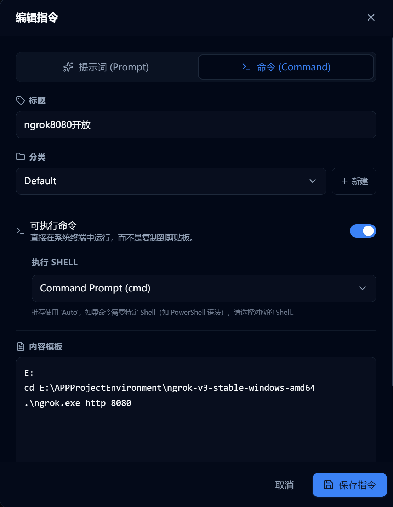

# CodeForge AI - 详细使用指南 (Detailed Usage Guide)

本文档提供了 CodeForge AI 各项核心功能的详细使用方法、配置指南和快捷键参考。

## 目录 (Table of Contents)

1.  [Context Forge (文件整合)](#1-context-forge-文件整合)
2.  [Spotlight (全局 AI 终端)](#2-spotlight-全局-ai-终端)
    *   [搜索模式 (Search Mode)](#-搜索模式-search-mode)
    *   [AI 对话模式 (AI Chat Mode)](#-ai-对话模式-ai-chat-mode)
3.  [Prompt Verse (提示词库)](#3-prompt-verse-提示词库)
4.  [Patch Weaver (AI 补全器)](#4-patch-weaver-ai-补全器)
5.  [配置指南 (Setup Guide)](#5-配置指南-setup-guide)
6.  [常用快捷键一览](#6-常用快捷键一览)

---

### 1. Context Forge (文件整合)
**解决痛点：** 快速将项目文件打包成 LLM (ChatGPT/Claude/DeepSeek) 易读的格式。

*   **文件选择**：在左侧文件树中勾选你需要让 AI 理解的代码文件或文件夹，或者通过设置设置全局过滤以及选择下方的过滤规则。
*   **智能统计**：底部仪表盘会实时显示选中文件的总大小、**预估 Token 数量**以及语言分布。
*   **Token 优化**：
    *   开启 **"Remove Comments"** 开关，自动剥离代码注释，节省大量 Token。
    *   自动识别并过滤二进制文件（如图片、PDF）。
*   **一键输出（建议下载为txt）**：点击 **Copy**，软件会将项目结构树和文件内容生成为结构化的 XML 文本，直接粘贴给 AI 即可，但是推荐导出成txt文档发送给AI。

### 2. Spotlight (全局 AI 终端)
**默认快捷键：** `Alt + S` (Windows) 或 `Option + S` (macOS)，在Linux上快捷键被阻止。快捷键可在设置中自定义。

Spotlight 是一个始终置顶的悬浮窗，拥有两种模式，按 **`Tab`** 键切换，按**`ESC`**退出：

#### 🔍 搜索模式 (Search Mode)
快速检索并使用你的指令库。
*   **搜索**：输入关键词查找本地或已下载的 Prompt/Command。
*   **执行**：对于命令指令，按`Enter`可以直接通过终端执行，执行通常是从上到下依次执行。
*   **复制**：按 `Enter` 直接将内容复制到剪贴板。

#### ✨ AI 对话模式 (AI Chat Mode)
无需切换浏览器，直接与 AI 对话。
*   **配置**：需要在设置的AI配置中配置API Key，并不是只能够配置上面名称中的模型，只要填写API地址和模型ID都能够运行任何LLM模型，推荐使用DeepSeek或者GLM的模型，GLM有免费模型可供调用。
*   **切换**：在搜索模式下按 `Tab` 键进入紫色界面的 AI 模式。
*   **对话**：输入问题并回车，体验流式打字机回复。支持 Markdown 渲染和代码高亮。
*   **思考过程**：支持 DeepSeek-R1 等推理模型，可折叠查看 AI 的 "Thinking Process"。
*   **清空上下文**：按 `Ctrl + K` (或 `Cmd + K`) 清空当前临时会话。
    *   *注意：Spotlight 主打“即用即走”，对话历史仅保存在内存中，重启软件后会自动清除。*

### 3. Prompt Verse (提示词库)
管理你的常用指令和 AI 提示词。

*   **创建与编辑**：支持创建自定义分组，编写包含变量（`{{variable}}`）的通用模板。
*   **官方商店**：在设置中进入 **Library**，下载离线的指令包（如 Linux 命令大全、编程辅助 Prompts）。
*   **遮蔽机制**：如果你收藏并修改了官方指令，本地修改将覆盖官方版本，互不冲突。
*   **命令执行**：可以创建可执行命令指令，直接点击通过终端执行，命令执行流程为从上到下，可参考本质上是一个执行脚本，理论上能够执行用户权限下的终端命令。

---

### 4. Patch Weaver (AI 补全器)
它的设计理念是填补“AI 生成代码”与“实际修改文件”之间的最后一步鸿沟，让用户无需手动复制粘贴每一处修改。

#### 核心定位
**“面向 LLM 的智能 Patch 工具”**
通过固定的句式让AI的输出直接能够融合到代码里面，无需手动复制查找粘贴。

#### 主要工作流程 (Workflow)

1.  **加载项目**：用户选择本地项目的根目录 (`projectRoot`)。
2.  **获取指令**：侧边栏提供了一个内置的 **"AI Instruction" (系统提示词)**。用户将其复制并发给AI，AI 按照特定格式（`<<<<<<< SEARCH` ... `>>>>>>> REPLACE`）返回代码修改建议，建议加上"使用md包裹代码"，不然md格式渲染出来会很难看。
3.  **粘贴补丁**：用户将 AI 返回的文本直接粘贴（可右键直接粘贴）到 Patch Weaver 的输入框中。
4.  **自动解析与匹配**：
    *   系统自动解析多文件补丁。
    *   **智能模糊匹配**：利用 `src/lib/patch_parser.ts` 中的算法，即使 AI 生成的代码缩进或空行与本地文件略有不同，系统也能基于 Token 流精确定位修改位置。
5.  **可视化审查 (Diff View)**：
    *   基于 Monaco Editor（VS Code 同款编辑器）的 Diff 视图。
    *   支持 **Split (分栏)** 和 **Unified (行内)** 两种对比模式。
    *   清晰展示 `Original`（本地原文件）与 `Modified`（应用补丁后的预览）。
6.  **确认与保存**：用户确认无误后，点击保存，修改将物理写入硬盘。

### 5. 配置指南 (Setup Guide)
为了使用 Spotlight 的 AI 对话功能，你需要配置模型提供商：

1.  点击左侧侧边栏底部的 **设置 (Settings)** 图标。
2.  进入 **AI Configuration** 选项卡。
3.  填写 API 信息：
    *   **Provider**: 选择 `DeepSeek` / `OpenAI` / `Anthropic` (仅作图标区分，并不是只能这三个选择)。
    *   **API Key**: 填入你的 API 密钥（数据仅存储在本地）。
    *   **Base URL**: (可选) 如果使用 **硅基流动 (SiliconFlow)** 或其他中转服务，请填写对应的 Base URL（例如 `https://api.siliconflow.cn`）。
    *   **Model ID**: 填入模型名称（例如 `deepseek-chat`）。

---

### 6. 常用快捷键一览

| 快捷键 | 作用域 | 功能 |
| :--- | :--- | :--- |
| `Alt + S` | 全局 | 唤起/隐藏 Spotlight 搜索框 |
| `Tab` | Spotlight | 切换 **搜索模式** / **AI 模式** |
| `Enter` | Spotlight | (搜索模式) 复制/执行指令 / (AI 模式) 发送消息 |
| `Ctrl + K` | Spotlight | (AI 模式) 清空当前对话历史 |
| `Esc` | 全局 | 关闭当前窗口或弹窗 |